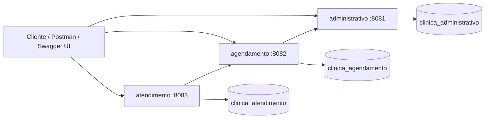

# Clínica Médica


Sistema acadêmico de gestão clínica desenvolvido com Java 17, Spring Boot 3 e arquitetura de microsserviços. O projeto organiza as rotinas administrativas, o agendamento de consultas e o atendimento clínico em módulos independentes, cada um com seu próprio banco de dados MySQL.

## Visão Geral

A aplicação foi desenhada para separar responsabilidades de negócio em três serviços principais:

- **Administrativo**: cadastro e manutenção de pacientes, médicos, especialidades, convênios, atendentes e relatórios.
- **Agendamento**: criação, consulta, confirmação, reagendamento e cancelamento de consultas.
- **Atendimento**: registro clínico da consulta, prontuário, anotações, exames e histórico do paciente.

O módulo **commons** centraliza entidades, repositories, services compartilhados, configurações comuns e testes de regra de negócio.

## Arquitetura



## Stack Técnica

| Camada | Tecnologias |
|---|---|
| Linguagem | Java 17 |
| Framework | Spring Boot 3.3.5 |
| API | Spring Web, Bean Validation, SpringDoc OpenAPI |
| Persistência | Spring Data JPA, Hibernate, MySQL 8 |
| Integração interna | RestTemplate com Apache HttpClient 5 |
| Mapeamento | ModelMapper |
| Build | Maven multi-módulo |
| Infraestrutura local | Docker Compose |
| Produtividade | Lombok, spring-dotenv |
| Testes | Spring Boot Starter Test, JUnit |

## Estrutura do Repositório

```text
clinica-medica/
├── administrativo/      # Microsserviço de cadastros, usuários administrativos e relatórios
├── agendamento/         # Microsserviço responsável pelo ciclo de vida das consultas
├── atendimento/         # Microsserviço de prontuário, anotações, exames e histórico
├── commons/             # Entidades, repositories, services e configurações compartilhadas
├── docs/                # Collections Postman, changelog técnico e material de revisão
├── docker-compose.yml   # Orquestração local dos serviços e bancos MySQL
└── pom.xml              # Projeto Maven agregador
```

## Módulos

| Módulo | Tipo | Porta | Banco | Responsabilidade |
|---|---:|---:|---|---|
| `commons` | Biblioteca interna | - | - | Regras compartilhadas, entidades, repositories e services |
| `administrativo` | Microsserviço | `8081` | `clinica_administrativo` | Cadastros, atendentes, convênios, médicos, pacientes e relatórios |
| `agendamento` | Microsserviço | `8082` | `clinica_agendamento` | Agenda médica, status da consulta e validações com administrativo |
| `atendimento` | Microsserviço | `8083` | `clinica_atendimento` | Atendimento clínico, prontuário, anotações, exames e histórico |

## Regras de Separação

Cada microsserviço possui seu próprio banco de dados e não compartilha relacionamentos JPA diretos com tabelas de outro módulo. Quando um serviço precisa referenciar dados externos, ele armazena apenas o identificador (`Long id`) e consulta o serviço dono da informação por HTTP.

Esse desenho mantém o isolamento entre contextos e evita acoplamento por `@ManyToOne` entre bancos diferentes.

## Comunicação Entre Serviços

| Origem | Destino | Uso |
|---|---|---|
| `agendamento` | `administrativo` | Valida se convênio, médico e paciente existem e estão aptos antes de agendar |
| `atendimento` | `agendamento` | Notifica a realização da consulta depois do registro clínico |

No Docker, os serviços se comunicam pelos nomes dos containers (`http://administrativo:8081` e `http://agendamento:8082`). Em execução local, os fallbacks usam `localhost`.

## Pré-requisitos

Para executar o projeto com conforto, tenha instalado:

- JDK 17.
- Maven 3.9 ou superior.
- Docker e Docker Compose.
- Um cliente HTTP, como Postman, Insomnia ou o próprio Swagger UI.

## Configuração de Ambiente

Crie um arquivo `.env` na raiz do projeto a partir do exemplo:

```env
DB_USER=root
DB_PASS=sua_senha
```

O arquivo `.env.example` já existe no repositório e serve como referência mínima. As aplicações também possuem valores padrão para desenvolvimento local, mas o Docker Compose espera essas variáveis para subir os bancos e serviços.

## Executando com Docker

Suba toda a stack com:

```bash
docker compose up --build
```

O Compose cria três bancos MySQL, aguarda os healthchecks e inicia os microsserviços na mesma rede interna.

Para parar a stack:

```bash
docker compose down
```

## Portas Locais

| Recurso | Porta local | Observação |
|---|---:|---|
| Administrativo | `8081` | API de cadastros e relatórios |
| Agendamento | `8082` | API de consultas |
| Atendimento | `8083` | API clínica |
| MySQL administrativo | `3307` | Banco `clinica_administrativo` |
| MySQL agendamento | `3308` | Banco `clinica_agendamento` |
| MySQL atendimento | `3309` | Banco `clinica_atendimento` |

## Executando Localmente sem Docker

Com os bancos MySQL disponíveis nas portas esperadas, instale os módulos e inicie os serviços separadamente:

```bash
mvn clean install
mvn -pl administrativo spring-boot:run
mvn -pl agendamento spring-boot:run
mvn -pl atendimento spring-boot:run
```

Execute cada `spring-boot:run` em um terminal próprio. O módulo `commons` é uma biblioteca interna e não sobe como aplicação web.

## Variáveis por Serviço

| Variável | Usada por | Valor padrão local | Finalidade |
|---|---|---|---|
| `DB_HOST` | Todos | `localhost` | Host do MySQL |
| `DB_PORT` | Todos | `3307`, `3308` ou `3309` | Porta do banco de cada serviço |
| `DB_USER` | Todos | `root` | Usuário do MySQL |
| `DB_PASS` | Todos | vazio | Senha do MySQL |
| `ADMINISTRATIVO_URL` | `agendamento` | `http://localhost:8081` | Base URL do administrativo |
| `AGENDAMENTO_URL` | `atendimento` | `http://localhost:8082` | Base URL do agendamento |

## Swagger

Cada microsserviço expõe documentação interativa com SpringDoc:

| Serviço | Swagger UI | OpenAPI JSON |
|---|---|---|
| Administrativo | `http://localhost:8081/swagger-ui.html` | `http://localhost:8081/v3/api-docs` |
| Agendamento | `http://localhost:8082/swagger-ui.html` | `http://localhost:8082/v3/api-docs` |
| Atendimento | `http://localhost:8083/swagger-ui.html` | `http://localhost:8083/v3/api-docs` |

## Endpoints - Administrativo

Base URL: `http://localhost:8081`

| Recurso | Métodos e rotas |
|---|---|
| Convênios | `GET /v1/convenios`, `GET /v1/convenios/{id}`, `POST /v1/convenios`, `PUT /v1/convenios/{id}`, `DELETE /v1/convenios/{id}`, `PATCH /v1/convenios/{id}/status` |
| Pacientes | `GET /v1/pacientes`, `GET /v1/pacientes/{id}`, `POST /v1/pacientes`, `PUT /v1/pacientes/{id}`, `DELETE /v1/pacientes/{id}` |
| Médicos | `GET /v1/medicos`, `GET /v1/medicos/ativos`, `GET /v1/medicos/{id}`, `POST /v1/medicos`, `PUT /v1/medicos/{id}`, `PATCH /v1/medicos/{id}/inativar`, `DELETE /v1/medicos/{id}` |
| Especialidades | `GET /v1/especialidades`, `GET /v1/especialidades/{id}`, `POST /v1/especialidades`, `PUT /v1/especialidades/{id}`, `DELETE /v1/especialidades/{id}` |
| Atendentes | `GET /v1/atendentes`, `POST /v1/atendentes`, `PUT /v1/atendentes/{id}`, `DELETE /v1/atendentes/{id}` |

### Relação Médico e Especialidade

O administrativo também expõe operações para vincular e remover especialidades de um médico:

| Operação | Rota |
|---|---|
| Associar especialidade | `POST /v1/medicos/{id}/especialidades/{especialidadeId}` |
| Remover especialidade | `DELETE /v1/medicos/{id}/especialidades/{especialidadeId}` |

### Relatórios Administrativos

| Relatório | Rota | Observação |
|---|---|---|
| Pacientes por convênio | `GET /v1/relatorios/pacientes-por-convenio?convenioId={id}` | Retorna pacientes vinculados ao convênio informado |
| Consultas diárias | `GET /v1/relatorios/consultas-diarias?data=yyyy-MM-dd` | Endpoint oculto no Swagger até a integração com agendamento ser finalizada |

## Endpoints - Agendamento

Base URL: `http://localhost:8082`

| Operação | Rota |
|---|---|
| Agendar consulta | `POST /v1/consultas` |
| Cancelar consulta | `DELETE /v1/consultas/{id}` |
| Reagendar consulta | `PATCH /v1/consultas/{id}/reagendar` |
| Confirmar consulta | `PATCH /v1/consultas/{id}/confirmar` |
| Listar por médico, paciente ou data | `GET /v1/consultas?medicoId={id}` / `?pacienteId={id}` / `?data=yyyy-MM-dd` |
| Agenda do médico | `GET /v1/consultas/minha-agenda?medicoId={id}` |

### Regras do Agendamento

Antes de registrar uma consulta, o serviço valida:

- se o convênio informado existe e está ativo;
- se o médico existe e está ativo;
- se o paciente existe;
- se não há conflito de horário para o médico;
- se a data de reagendamento não está no passado.

## Endpoints - Atendimento

Base URL: `http://localhost:8083`

| Operação | Rota |
|---|---|
| Registrar atendimento | `POST /v1/atendimentos` |
| Buscar prontuário por consulta | `GET /v1/atendimentos/{consultaId}` |
| Histórico por paciente | `GET /v1/atendimentos/historico?pacienteId={id}` |
| Adicionar anotação | `POST /v1/atendimentos/{id}/anotacoes` |
| Listar anotações | `GET /v1/atendimentos/{id}/anotacoes` |
| Solicitar exame | `POST /v1/atendimentos/{id}/exames` |
| Listar exames | `GET /v1/atendimentos/{id}/exames` |

### Fluxo do Atendimento

Ao registrar um atendimento, o serviço cria o atendimento, gera o prontuário com descrição, diagnóstico e observações, e tenta notificar o agendamento sobre a realização da consulta. Se a notificação falhar, o atendimento continua registrado e a falha é registrada em log para análise.

## Principais Entidades

| Entidade | Contexto |
|---|---|
| `ConvenioEntity` | Convênios aceitos pela clínica e status de disponibilidade |
| `PacienteEntity` | Dados cadastrais do paciente e vínculo com convênio |
| `MedicoEntity` | Dados profissionais, CRM, status ativo e especialidades |
| `AtendenteEntity` | Usuários administrativos e recepção |
| `ConsultaEntity` | Agendamento, médico, paciente, convênio, data e status |
| `AtendimentoEntity` | Registro clínico associado a uma consulta |
| `ProntuarioEntity` | Descrição, diagnóstico e observações do atendimento |
| `AnotacaoEntity` | Anotações adicionais do prontuário |
| `SolicitacaoExameEntity` | Exames solicitados durante o atendimento |

## Status de Negócio

O agendamento usa status próprios para controlar o ciclo de vida de uma consulta. O atendimento também possui status para representar o andamento do registro clínico. Esses enums ficam no módulo `commons`, junto das entidades compartilhadas.

Na prática, a API evita transições inválidas, como confirmar uma consulta que não está pendente ou cancelar uma consulta que já chegou a um estado terminal.

## Tratamento de Erros

Os microsserviços possuem handlers globais para padronizar respostas de erro. As APIs retornam status HTTP coerentes com o cenário:

| Status | Cenário comum |
|---:|---|
| `400` | Payload inválido, filtro obrigatório ausente ou regra de negócio violada |
| `404` | Recurso inexistente |
| `409` | Conflito de estado, CRM duplicado, usuário duplicado ou horário indisponível |
| `500` | Erro inesperado |

## Validações

Os DTOs de entrada usam Bean Validation para impedir payloads incompletos ou inconsistentes antes de chegar à camada de serviço. Além das validações estruturais, os services concentram regras como unicidade de CRM, unicidade de usuário, status ativo de convênios e médicos, e conflitos de horário em consultas.

Esse desenho mantém os controllers enxutos e deixa as decisões de negócio testáveis no módulo `commons`.

## Collections Postman

O diretório `docs/` contém collections prontas para exercitar os principais fluxos da API:

- `docs/convenio-collection.json`
- `docs/paciente-collection.json`
- `docs/medico-collection.json`
- `docs/especialidade-collection.json`
- `docs/atendente-collection.json`
- `docs/consulta-collection.json`
- `docs/atendimento-collection.json`
- `docs/relatorios-collection.json`

Importe as collections no Postman e ajuste as variáveis de host conforme o serviço testado.

## Testes

Execute a suíte completa com:

```bash
mvn test
```

Para testar apenas o módulo compartilhado:

```bash
mvn -pl commons test
```

Os testes atuais cobrem regras de services como convênios, pacientes, especialidades, médicos, atendentes, consultas e atendimentos.

## Build

Para compilar todos os módulos:

```bash
mvn clean package
```

Para compilar sem rodar os testes:

```bash
mvn clean package -DskipTests
```

Como o projeto é multi-módulo, o Maven usa o `pom.xml` da raiz como agregador e respeita a ordem necessária entre `commons` e os microsserviços.

## Fluxo Recomendado de Teste Manual

1. Subir a stack com `docker compose up --build`.
2. Criar convênios, especialidades, médicos, pacientes e atendentes no administrativo.
3. Associar especialidades aos médicos.
4. Criar consultas pelo agendamento.
5. Confirmar ou reagendar consultas conforme o cenário.
6. Registrar o atendimento, adicionar anotações e solicitar exames.
7. Consultar histórico, prontuário e relatórios.

## Decisões de Design

- **Banco por serviço**: preserva a autonomia de cada contexto.
- **Módulo `commons`**: evita duplicação de entidades, repositories e regras compartilhadas neste projeto acadêmico.
- **DTOs por serviço**: impede exposição direta das entidades nas APIs.
- **Handlers globais**: padronizam respostas de erro e reduzem repetição nos controllers.
- **Swagger por serviço**: facilita validação independente de cada microsserviço.
- **Collections Postman**: documentam fluxos completos e apoiam testes manuais.

## Troubleshooting

| Problema | Possível causa | Solução |
|---|---|---|
| Serviço não conecta ao banco | MySQL ainda não está pronto | Aguarde o healthcheck do Docker ou reinicie o serviço |
| Porta ocupada | Outro processo usando `8081`, `8082`, `8083`, `3307`, `3308` ou `3309` | Pare o processo conflitante ou altere a porta local |
| Erro de autenticação no MySQL | `.env` incompleto ou senha divergente | Revise `DB_USER` e `DB_PASS` |
| Agendamento recusa consulta | Convênio, médico ou paciente inválido/inativo | Cadastre e valide os dados no administrativo |
| Reagendamento falha | Data no passado ou conflito de horário | Use data futura e horário disponível |
