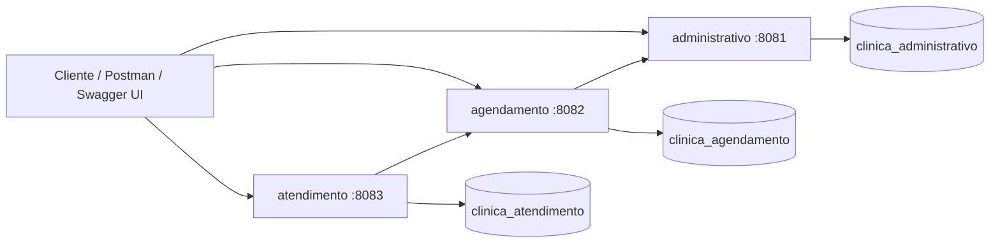

# Clínica Médica


Sistema acadêmico de gestão clínica desenvolvido com Java 17, Spring Boot 3 e arquitetura de microsserviços. O projeto organiza as rotinas administrativas, o agendamento de consultas e o atendimento clínico em módulos independentes, cada um com seu próprio banco de dados MySQL.

## Visão Geral

A aplicação foi desenhada para separar responsabilidades de negócio em três serviços principais:

- **Administrativo**: cadastro e manutenção de pacientes, médicos, especialidades, convênios, atendentes e relatórios.
- **Agendamento**: criação, consulta, confirmação, reagendamento e cancelamento de consultas.
- **Atendimento**: registro clínico da consulta, prontuário, anotações, exames e histórico do paciente.

O módulo **commons** centraliza entidades, repositories, services compartilhados, configurações comuns e testes de regra de negócio.

## Arquitetura



## Stack Técnica

| Camada | Tecnologias |
|---|---|
| Linguagem | Java 17 |
| Framework | Spring Boot 3.3.5 |
| API | Spring Web, Bean Validation, SpringDoc OpenAPI |
| Persistência | Spring Data JPA, Hibernate, MySQL 8 |
| Integração interna | RestTemplate com Apache HttpClient 5 |
| Mapeamento | ModelMapper |
| Build | Maven multi-módulo |
| Infraestrutura local | Docker Compose |
| Produtividade | Lombok, spring-dotenv |
| Testes | Spring Boot Starter Test, JUnit |

## Estrutura do Repositório

```text
clinica-medica/
├── administrativo/      # Microsserviço de cadastros, usuários administrativos e relatórios
├── agendamento/         # Microsserviço responsável pelo ciclo de vida das consultas
├── atendimento/         # Microsserviço de prontuário, anotações, exames e histórico
├── commons/             # Entidades, repositories, services e configurações compartilhadas
├── docs/                # Collections Postman, changelog técnico e material de revisão
├── docker-compose.yml   # Orquestração local dos serviços e bancos MySQL
└── pom.xml              # Projeto Maven agregador
```

## Módulos

| Módulo | Tipo | Porta | Banco | Responsabilidade |
|---|---:|---:|---|---|
| `commons` | Biblioteca interna | - | - | Regras compartilhadas, entidades, repositories e services |
| `administrativo` | Microsserviço | `8081` | `clinica_administrativo` | Cadastros, atendentes, convênios, médicos, pacientes e relatórios |
| `agendamento` | Microsserviço | `8082` | `clinica_agendamento` | Agenda médica, status da consulta e validações com administrativo |
| `atendimento` | Microsserviço | `8083` | `clinica_atendimento` | Atendimento clínico, prontuário, anotações, exames e histórico |
