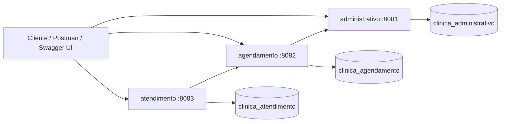

# Clínica Médica


Sistema acadêmico de gestão clínica desenvolvido com Java 17, Spring Boot 3 e arquitetura de microsserviços. O projeto organiza as rotinas administrativas, o agendamento de consultas e o atendimento clínico em módulos independentes, cada um com seu próprio banco de dados MySQL.

## Visão Geral

A aplicação foi desenhada para separar responsabilidades de negócio em três serviços principais:

- **Administrativo**: cadastro e manutenção de pacientes, médicos, especialidades, convênios, atendentes e relatórios.
- **Agendamento**: criação, consulta, confirmação, reagendamento e cancelamento de consultas.
- **Atendimento**: registro clínico da consulta, prontuário, anotações, exames e histórico do paciente.

O módulo **commons** centraliza entidades, repositories, services compartilhados, configurações comuns e testes de regra de negócio.

## Arquitetura



## Stack Técnica

| Camada | Tecnologias |
|---|---|
| Linguagem | Java 17 |
| Framework | Spring Boot 3.3.5 |
| API | Spring Web, Bean Validation, SpringDoc OpenAPI |
| Persistência | Spring Data JPA, Hibernate, MySQL 8 |
| Integração interna | RestTemplate com Apache HttpClient 5 |
| Mapeamento | ModelMapper |
| Build | Maven multi-módulo |
| Infraestrutura local | Docker Compose |
| Produtividade | Lombok, spring-dotenv |
| Testes | Spring Boot Starter Test, JUnit |

## Estrutura do Repositório

```text
clinica-medica/
├── administrativo/      # Microsserviço de cadastros, usuários administrativos e relatórios
├── agendamento/         # Microsserviço responsável pelo ciclo de vida das consultas
├── atendimento/         # Microsserviço de prontuário, anotações, exames e histórico
├── commons/             # Entidades, repositories, services e configurações compartilhadas
├── docs/                # Collections Postman, changelog técnico e material de revisão
├── docker-compose.yml   # Orquestração local dos serviços e bancos MySQL
└── pom.xml              # Projeto Maven agregador
```

## Módulos

| Módulo | Tipo | Porta | Banco | Responsabilidade |
|---|---:|---:|---|---|
| `commons` | Biblioteca interna | - | - | Regras compartilhadas, entidades, repositories e services |
| `administrativo` | Microsserviço | `8081` | `clinica_administrativo` | Cadastros, atendentes, convênios, médicos, pacientes e relatórios |
| `agendamento` | Microsserviço | `8082` | `clinica_agendamento` | Agenda médica, status da consulta e validações com administrativo |
| `atendimento` | Microsserviço | `8083` | `clinica_atendimento` | Atendimento clínico, prontuário, anotações, exames e histórico |

## Regras de Separação

Cada microsserviço possui seu próprio banco de dados e não compartilha relacionamentos JPA diretos com tabelas de outro módulo. Quando um serviço precisa referenciar dados externos, ele armazena apenas o identificador (`Long id`) e consulta o serviço dono da informação por HTTP.

Esse desenho mantém o isolamento entre contextos e evita acoplamento por `@ManyToOne` entre bancos diferentes.

## Comunicação Entre Serviços

| Origem | Destino | Uso |
|---|---|---|
| `agendamento` | `administrativo` | Valida se convênio, médico e paciente existem e estão aptos antes de agendar |
| `atendimento` | `agendamento` | Notifica a realização da consulta depois do registro clínico |

No Docker, os serviços se comunicam pelos nomes dos containers (`http://administrativo:8081` e `http://agendamento:8082`). Em execução local, os fallbacks usam `localhost`.

## Pré-requisitos

Para executar o projeto com conforto, tenha instalado:

- JDK 17.
- Maven 3.9 ou superior.
- Docker e Docker Compose.
- Um cliente HTTP, como Postman, Insomnia ou o próprio Swagger UI.

## Configuração de Ambiente

Crie um arquivo `.env` na raiz do projeto a partir do exemplo:

```env
DB_USER=root
DB_PASS=sua_senha
```

O arquivo `.env.example` já existe no repositório e serve como referência mínima. As aplicações também possuem valores padrão para desenvolvimento local, mas o Docker Compose espera essas variáveis para subir os bancos e serviços.

## Executando com Docker

Suba toda a stack com:

```bash
docker compose up --build
```

O Compose cria três bancos MySQL, aguarda os healthchecks e inicia os microsserviços na mesma rede interna.

Para parar a stack:

```bash
docker compose down
```

## Portas Locais

| Recurso | Porta local | Observação |
|---|---:|---|
| Administrativo | `8081` | API de cadastros e relatórios |
| Agendamento | `8082` | API de consultas |
| Atendimento | `8083` | API clínica |
| MySQL administrativo | `3307` | Banco `clinica_administrativo` |
| MySQL agendamento | `3308` | Banco `clinica_agendamento` |
| MySQL atendimento | `3309` | Banco `clinica_atendimento` |

## Executando Localmente sem Docker

Com os bancos MySQL disponíveis nas portas esperadas, instale os módulos e inicie os serviços separadamente:

```bash
mvn clean install
mvn -pl administrativo spring-boot:run
mvn -pl agendamento spring-boot:run
mvn -pl atendimento spring-boot:run
```

Execute cada `spring-boot:run` em um terminal próprio. O módulo `commons` é uma biblioteca interna e não sobe como aplicação web.

## Variáveis por Serviço

| Variável | Usada por | Valor padrão local | Finalidade |
|---|---|---|---|
| `DB_HOST` | Todos | `localhost` | Host do MySQL |
| `DB_PORT` | Todos | `3307`, `3308` ou `3309` | Porta do banco de cada serviço |
| `DB_USER` | Todos | `root` | Usuário do MySQL |
| `DB_PASS` | Todos | vazio | Senha do MySQL |
| `ADMINISTRATIVO_URL` | `agendamento` | `http://localhost:8081` | Base URL do administrativo |
| `AGENDAMENTO_URL` | `atendimento` | `http://localhost:8082` | Base URL do agendamento |
