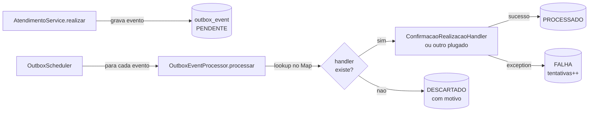

# Roadmap SOLID — Clinica Medica

Documento de plano para o grupo. Define o que vamos refatorar para aplicar SOLID,
em que ordem, com referências aos arquivos reais do projeto. Não é manifesto
teórico, é roteiro de trabalho.

---

## 1. Postura

SOLID é ferramenta de design, não nota de prova. A regra é aplicar onde a dor
for real (regra nova quebra três arquivos, classe inflou pra 400 linhas, teste de
um caso quebra outro). Inventar abstração só pra ter abstração reproduz exatamente
o problema que SOLID tenta resolver: indireção demais e ninguém sabe onde a regra
mora.

Postura assumida neste roadmap: pragmática. Não vamos reescrever Convenio nem
Paciente — eles já estão bem segmentados na arquitetura atual
(`commons/entities/<dominio>` + `commons/repositories/<dominio>` +
`commons/services/<dominio>`). Vamos atacar dois pontos onde o crescimento
previsto vai doer e deixar o resto reativo.

---

## 2. Estado atual: o que o projeto já entrega bem

Antes do plano, vale reconhecer o que não precisa mexer:

- A separação por domínio em `commons/` já isola responsabilidades em nível de
  pacote. Cada serviço tem um motivo de mudar (SRP em escala arquitetural).
- O Outbox já delega: `OutboxScheduler` drena, `OutboxEventProcessor` processa um
  evento, `OutboxEventRepository` consulta. Três classes, três motivos de mudar.
- Os Feign clients são pequenos e envoltos por adapters de domínio. No
  atendimento: `AgendamentoFeignClient` (interface Feign) +
  `AgendamentoClient` (adapter `@Component` que traduz `FeignException.NotFound`
  e `Conflict` em `EventoPermanenteException`). No agendamento:
  `AdministrativoClient`. Domínio depende do adapter, não do FeignClient direto
  (ISP na prática + isolamento de erros de transporte).
- Spring praticamente força DIP via `@Autowired` em interfaces
  (`ConvenioRepository`, `OutboxEventRepository`).

A intuição "o projeto está SOLID" não é só sorte. A arquitetura de microsserviços
+ commons + repositórios JPA já empurra metade do trabalho.

---

## 3. Onde dói (ou vai doer) e precisa de plano

Dois pontos:

1. O `ServiceTokenProvider` é classe concreta acoplada ao Keycloak e existe três
   vezes (uma cópia em cada microsserviço). Trocar provedor de autenticação =
   reescrever três classes.
2. O `OutboxEventProcessor` hoje processa um único `eventType`. Quando o segundo
   tipo aparecer (cancelamento, reagendamento, lembrete 24h), o reflexo errado
   é meter `switch` dentro do processor.

Os dois são acionáveis agora, custo baixo, ganho garantido.

---

## 4. Fase 1 — Refatorações que valem agora

### 4.1 ServiceTokenProvider vira abstração (DIP)

**Dor.** A classe `ServiceTokenProvider` mora em três lugares:

- `atendimento/src/main/java/br/edu/imepac/atendimento/integration/agendamento/ServiceTokenProvider.java`
- `agendamento/src/main/java/br/edu/imepac/agendamento/integration/administrativo/ServiceTokenProvider.java`
- `administrativo/src/main/java/br/edu/imepac/administrativo/integration/agendamento/ServiceTokenProvider.java`

Cada cópia sabe da URL do Keycloak, do `client_id` e do `client_secret`. No dia
em que migrar pra Auth0, Okta ou um provedor próprio, são três rewrites em três
módulos, sem teste de regressão de provedor.

**Estado atual do pacote de integração (mesmo padrão nos três módulos):**

```
integration/<servico-alvo>/
├── *Client.java                    (interface Feign)
├── *FeignConfig.java               (RequestInterceptor que injeta o token)
└── ServiceTokenProvider.java       (classe concreta acoplada ao Keycloak)
```

As três cópias são quase idênticas. Mudam só `client_id`, escopo do token, e
qual serviço cada uma chama. Toda a lógica de fetch + cache + refresh é igual.

**Passos exatos pra refatorar (por módulo):**

1. **Renomear** a classe atual para `KeycloakServiceTokenProvider`. No IntelliJ,
   `Shift+F6` em cima do nome — todos os usos e imports são atualizados.
2. **Criar interface** no mesmo pacote, com a assinatura pública atual:
   ```java
   public interface ServiceTokenProvider {
       String obterToken();
   }
   ```
3. **Marcar a classe renomeada** como implementação ativa do Keycloak:
   ```java
   @Component
   @ConditionalOnProperty(
           name = "auth.provider",
           havingValue = "keycloak",
           matchIfMissing = true)
   class KeycloakServiceTokenProvider implements ServiceTokenProvider {
       // corpo atual da classe sem alteração
   }
   ```
4. **Atualizar o `RequestInterceptor`** (no `*FeignConfig`) pra depender da
   interface, não da classe concreta:
   ```java
   private final ServiceTokenProvider tokenProvider; // antes: KeycloakServiceTokenProvider
   ```
   Spring resolve sozinho pela única implementação ativa.
5. **Rodar `mvn test`** no módulo. Os testes do client devem continuar verdes
   (Mockito mocka interface igual a classe concreta).
6. **Documentar** a nova flag `auth.provider` no `.env.example`.

**Ordem entre módulos.**

Recomendado fazer um módulo de cada vez, na ordem `atendimento → agendamento →
administrativo`. Cada módulo é um commit atômico:

- `refactor(integration): extrai ServiceTokenProvider como interface no atendimento`
- `refactor(integration): extrai ServiceTokenProvider como interface no agendamento`
- `refactor(integration): extrai ServiceTokenProvider como interface no administrativo`
- `docs(env-example): documenta auth.provider`

**Esforço.** ~1h por módulo, ~3h somando, mais revisão de PR.

**Risco.** Baixo. Refatoração puramente estrutural, coberta pelos testes que já
existem.

**Ganho no dia D.** Trocar de provedor passa a ser "escreve
`Auth0ServiceTokenProvider`, ajusta `auth.provider=auth0` no `.env`, deploy".
Zero modificação no Feign interceptor, zero modificação nos services.

### 4.2 Outbox com handlers por eventType (OCP)

**Dor.** O `OutboxEventProcessor`
(`atendimento/src/main/java/br/edu/imepac/atendimento/outbox/`) hoje trata só
`CONFIRMACAO_REALIZACAO`. O campo `eventType` no `OutboxEvent` existe pra suportar
vários tipos, mas a forma errada de implementar o próximo é abrir o processor e
meter `switch (evento.getEventType())`. Cada tipo novo reabre o mesmo arquivo,
cada teste do processor cresce, cada bug fixado num caso arrisca quebrar os
outros.

**Fluxo atual.**

```mermaid
flowchart LR
    A[AtendimentoService.realizar] -->|grava evento na mesma tx| B[(outbox_event<br/>PENDENTE)]
    C[OutboxScheduler<br/>@Scheduled fixedDelay] -->|busca PENDENTE+FALHA| B
    C -->|para cada evento| D[OutboxEventProcessor.processar]
    D -->|if CONFIRMACAO_REALIZACAO| E[AgendamentoClient.confirmarRealizacao<br/>adapter -> Feign call]
    D -->|outro tipo?| F[sem caminho definido]
    E -->|sucesso| G[(PROCESSADO)]
    E -->|falha| H[(FALHA<br/>tentativas++)]
```

O ramo `F` é o sintoma: hoje só existe um `eventType` ativo. Adicionar o segundo
significaria empurrar `switch` pra dentro do `D`.

**Fluxo proposto.**



Cada handler novo é uma classe nova com a anotação `@Component`. Spring detecta,
o `Map` no processor se constrói no `@PostConstruct`, zero alteração no
scheduler ou no processor.

**Plano.**

Visibilidade: a interface fica **package-private** (sem `public`) pra alinhar
com o `OutboxEventProcessor`, que ja' e' package-private por decisao
arquitetural documentada (deve ser usado apenas pelo `OutboxScheduler` do
mesmo pacote). Handler em outro pacote nao precisa existir nesse modelo —
todos vivem em `br.edu.imepac.atendimento.outbox`.

```java
interface OutboxEventHandler {
    String eventType();
    void handle(OutboxEvent evento);
}

@Component
class ConfirmacaoRealizacaoHandler implements OutboxEventHandler {
    private final AgendamentoClient agendamentoClient; // adapter, nao FeignClient

    ConfirmacaoRealizacaoHandler(AgendamentoClient agendamentoClient) {
        this.agendamentoClient = agendamentoClient;
    }

    @Override
    public String eventType() {
        return "CONFIRMACAO_REALIZACAO";
    }

    @Override
    public void handle(OutboxEvent evento) {
        // aggregateId carrega o consultaId
        // AgendamentoClient ja traduz 404/409 em EventoPermanenteException —
        // handler nao precisa repetir esse tratamento
        agendamentoClient.confirmarRealizacao(Long.valueOf(evento.getAggregateId()));
    }
}
```

O processor fica fino e preserva a semântica atual de erro permanente vs
transitório. Hoje o `OutboxEventProcessor` já distingue erros via
`EventoPermanenteException` (DESCARTADO direto, sem retry) de erros genéricos
(tentativas++ via `registrarFalha(maxRetry)`). O refactor mantém esse fluxo,
só troca a entrega hardcoded por um lookup de handler:

```java
@Component
class OutboxEventProcessor {

    private final Map<String, OutboxEventHandler> handlersPorTipo;
    private final OutboxEventRepository repository;
    private final int maxRetry;

    OutboxEventProcessor(List<OutboxEventHandler> handlers,
                         OutboxEventRepository repository,
                         @Value("${outbox.max-retry:3}") int maxRetry) {
        this.handlersPorTipo = handlers.stream()
                .collect(Collectors.toUnmodifiableMap(
                        OutboxEventHandler::eventType, h -> h));
        this.repository = repository;
        this.maxRetry = maxRetry;
    }

    void processar(OutboxEvent evento) {
        try {
            entregar(evento);
            evento.marcarProcessado();
        } catch (EventoPermanenteException e) {
            // erro irrecuperável — DESCARTADO sem retry
            evento.descartar();
            // log com detalhe (id, eventType, mensagem)
        } catch (Exception e) {
            // erro transitório — registrarFalha incrementa tentativas e
            // promove a DESCARTADO se esgotou maxRetry
            evento.registrarFalha(maxRetry);
        }
        repository.save(evento);
    }

    private void entregar(OutboxEvent evento) {
        OutboxEventHandler handler = handlersPorTipo.get(evento.getEventType());
        if (handler == null) {
            throw new EventoPermanenteException(
                    "Tipo de evento outbox desconhecido: " + evento.getEventType());
        }
        handler.handle(evento);
    }
}
```

API real do `OutboxEvent` (já implementada no projeto): `marcarProcessado()`,
`descartar()` sem args (o motivo é logado pelo processor via SLF4J), e
`registrarFalha(int maxRetry)` que incrementa tentativas e promove a
`DESCARTADO` quando atinge o limite.

**Testes a atualizar/criar:**

- `OutboxSchedulerTest`: continua igual, só verifica delegação.
- `OutboxEventProcessorTest`: testa o roteamento (handler conhecido, handler
  ausente, handler que lança exceção).
- `ConfirmacaoRealizacaoHandlerTest`: testa a integração com o Feign client
  mockado.

**Esforço.** ~3-4h.

**Risco.** Baixo. A cobertura existente do scheduler protege a maior parte do
caminho.

**Ganho no dia D.** Quando `CANCELAMENTO` ou `REAGENDAMENTO` aparecer, é uma
classe nova, um teste novo, zero alteração no processor ou no scheduler.

### 4.3 Estratégia de testes para os refactors da fase 1

Os dois refactors da fase 1 são estruturais. Mesma lógica, organização
diferente. Vale aproveitar pra apertar a cobertura, mas sem inflar a suíte sem
necessidade.

**Para 4.1 (ServiceTokenProvider):**

Os testes existentes do `*FeignConfig` mockam `ServiceTokenProvider`. Após o
refactor:

- Continuam funcionando sem alteração (Mockito mocka interface tão bem quanto
  classe).
- Renomear variável de mock pra `mockTokenProvider` se estava como
  `mockKeycloakTokenProvider`. Clareza.
- Adicionar `KeycloakServiceTokenProviderTest` se ainda não existir, cobrindo:
  token é cacheado entre chamadas, refresh acontece após `expires_in`, exceção
  do Keycloak propaga e não fica em loop infinito.

Não criar `ServiceTokenProviderTest` em cima da interface vazia — não há
comportamento default pra testar.

**Para 4.2 (Outbox handlers):**

Reestruturar a suíte em três camadas, cada uma com escopo claro:

1. **`OutboxSchedulerTest`** (existente, quase não muda) — valida que o
   scheduler delega cada evento do batch ao processor. Continua mockando o
   processor por completo.
2. **`OutboxEventProcessorTest`** (novo ou ajustado) — valida só o roteamento.
   Casos mínimos:
   - Handler conhecido + sucesso → status `PROCESSADO`.
   - Handler conhecido + exceção → status `FALHA`, `tentativas` incrementado.
   - Handler ausente → status `DESCARTADO` com mensagem clara.
   - Lista vazia de handlers no constructor → log de alerta no startup (sanity
     check, evita configuração silenciosa errada).
3. **`ConfirmacaoRealizacaoHandlerTest`** (novo) — testa a chamada do Feign
   client mockado. Move pra cá os asserts que hoje estão no
   `OutboxEventProcessorTest` sobre lógica específica desse handler.

**Métrica de sucesso da reestruturação:**

Cobertura de linhas/branches deve subir ou ficar igual. Número absoluto de
testes provavelmente cai (consolidação remove duplicação). Não é problema, é
sinal de que os testes pararam de testar a mesma coisa em três lugares.

**Antes de mergear, rodar:**

```bash
mvn -pl atendimento test
mvn -pl administrativo test
mvn -pl agendamento test
mvn -pl commons test
```

E o smoke test do stack completo: `docker-compose up -d`, criar uma consulta
via Postman e confirmar que o evento sai `PROCESSADO` em até 10s (o
`poll-interval-ms` padrão).

---

## 5. Fase 2 — Reativo, faz quando a dor aparecer

Não dá pra cravar quando isso vai acontecer. Os gatilhos:

### 5.1 Validators de service (OCP + SRP)

**Gatilho.** Método de service com 4+ `if` validando regras de negócio, ou a
mesma validação repetida em dois services diferentes.

```java
public interface Validator<T> {
    void validar(T request);
}

@Component
class CrmObrigatorioValidator implements Validator<MedicoRequest> {
    @Override
    public void validar(MedicoRequest req) {
        if (req.crm() == null || req.crm().isBlank()) {
            throw new ValidacaoException("CRM e obrigatorio");
        }
    }
}
```

O service injeta `List<Validator<MedicoRequest>> validators` e roda em sequência.
Validator novo = classe nova, zero alteração no service.

**Quando NÃO fazer.** Service com duas validações triviais. `if` é mais legível e
mais fácil de debugar.

### 5.2 Quebra de service gordo (SRP + ISP)

**Gatilho.** Service com 12+ métodos públicos onde controllers diferentes usam
subconjuntos sem sobreposição.

Padrão sugerido (CQRS-lite):

- `ConsultaCommandService` — `criar`, `confirmar`, `cancelar`, `realizar`
- `ConsultaQueryService` — `listar`, `buscarPorId`, `agendaDoMedico`
- `ConsultaMaintenanceService` — `purgarAntigas`, recálculos batch

Não fazer preventivamente. Hoje o `ConsultaService` tem 6-8 métodos, não dói. No
dia em que passar dos 12, conversar antes de mergear.

### 5.3 Strategy para regras de negócio com variação (OCP)

**Gatilho.** Regra varia por contexto e não cai bem em `if`.

Casos prováveis no domínio:

- Cálculo de valor de consulta por convênio.
- Política de cancelamento por tipo (eletiva vs. urgência).
- Política de retry diferente por tipo de evento do outbox.

Mesmo padrão do `OutboxEventHandler`: interface + implementações + roteamento por
chave.

---

## 6. Fase 3 — Higiene contínua

Sem entregável, é cultura.

### 6.1 Três perguntas no template de PR

Adicionar no PR description:

1. Alguma classe nova com mais de uma responsabilidade clara? Por quê?
2. Algum `if/else` por tipo que poderia ser polimorfismo?
3. Alguma dependência concreta onde uma interface valeria? (Aceitável responder
   "não vale agora", desde que documentado.)

Não é gate de CI. É espelho. Força o autor a pensar antes da revisão.

### 6.2 Sinais de alerta em revisão

Sem virar burocracia automatizada, atenção em revisão para:

- Service com mais de 200 linhas — autor justifica.
- Classe com 5+ dependências injetadas — cheiro de SRP violado.
- Método com mais de 50 linhas — quebrar antes de mergear.

---

## 7. Anti-padrões a evitar neste roadmap

Algumas armadilhas que parecem SOLID mas não são:

A primeira, e a mais comum, é **interface só pra ter interface**.
`IConvenioService` + `ConvenioServiceImpl` quando só existe uma implementação e
nunca vai existir outra. Não traz testabilidade nova (Mockito mocka classes
concretas sem problema), só polui o pacote. Se tem mais de uma implementação
real, ou se a injeção é em código fora do seu controle, aí vale.

Segunda: **hierarquia precoce**. Criar `BaseUsuarioEntity` pra três entidades com
dois campos em comum. Composição via `@Embeddable` resolve melhor, evita o
problema de LSP no futuro e não força ninguém a herdar comportamento que não
quer.

Terceira: **factory pra tudo**. Em CRUD normal, `new ConvenioRequest()` no
controller não precisa virar `ConvenioRequestFactory`. Factory faz sentido quando
a criação tem regra (gerar UUID, popular auditoria automática) que se repete em
vários lugares.

Quarta: **evento pra tudo**. O outbox existe pra desacoplar microsserviços.
Dentro do mesmo microsserviço, chamada direta de service é mais simples e mais
debugável. Se alguém propor "vou disparar um evento e o outro service do mesmo
módulo escuta", segura.

---

## 8. Checklist de PR para refactor SOLID

Para cada PR de refatoração:

- [ ] `mvn clean install` passa na raiz
- [ ] Testes existentes continuam verdes
- [ ] Cobertura do código novo igual ou maior que a do código removido
- [ ] Postman collections do domínio afetado rodam sem regressão
- [ ] Swagger UI continua subindo e respondendo
- [ ] Commits atômicos no padrão `tipo(escopo): descricao`
  - ex: `refactor(integration): extrai ServiceTokenProvider para interface`
- [ ] Diário de desenvolvimento no Obsidian atualizado
- [ ] PR description responde as três perguntas da seção 6.1

---

## 9. Divisão sugerida no grupo

Pra evitar conflito de merge, as tarefas da fase 1 podem ir em paralelo:

| Tarefa                          | Dono     | Branch                                   | Módulos                                          |
|---------------------------------|----------|------------------------------------------|--------------------------------------------------|
| 4.1 ServiceTokenProvider (DIP)  | 1 pessoa | `refactor/dip-service-token-provider`    | administrativo + agendamento + atendimento       |
| 4.2 Outbox handlers (OCP)       | 1 pessoa | `refactor/ocp-outbox-handlers`           | atendimento                                      |

Como 4.1 toca os três microsserviços e 4.2 toca só atendimento, dá pra mergear
na ordem: primeiro 4.2 (escopo menor, risco menor), depois 4.1 (mais arquivos,
mais revisão).

Tarefas da fase 2 são reativas. Quando aparecer o gatilho, quem está
implementando a feature traz o refactor no mesmo PR ou em PR antecessor.

---

## 10. Métricas de sucesso

Como saber daqui a três sprints se valeu:

- Quando o segundo tipo de evento de outbox entrar, foi 1 classe nova sem mexer
  no processor? Marcou ponto.
- Quando alguém perguntar "como troco de Keycloak pra X?", a resposta foi
  "escreve uma classe que implementa `ServiceTokenProvider`"? Marcou ponto.
- Se daqui a três meses ninguém usou a interface `ServiceTokenProvider` pra
  plugar outro provedor e a `KeycloakServiceTokenProvider` continua sendo a
  única implementação, a interface ainda assim valeu pelo desacoplamento ou foi
  cerimônia? Conversa honesta no retrô. Não tem vergonha em reverter.

---

## 11. Ordem de execução resumida

1. Grupo lê este documento, sinaliza concordância ou contraproposta.
2. Define donos das tarefas 4.1 e 4.2 na próxima daily.
3. Cria as duas branches em paralelo.
4. Mergeia 4.2 primeiro (menor escopo).
5. Mergeia 4.1 depois (toca três módulos).
6. Atualiza template de PR com as três perguntas da seção 6.1.
7. Fase 2 fica documentada como gatilho-reativo. Não tem deadline.

---

## 12. Referências

- Robert C. Martin, *Clean Architecture*, capítulos 7 a 11. Cobre SOLID com
  exemplos.
- Robert C. Martin, *Design Principles and Design Patterns* (2000). PDF aberto.
  Trinta páginas, suficiente como leitura de grupo.
- Eric Evans, *Domain-Driven Design*, parte II. Pra quando o grupo quiser ir
  além de SOLID em direção a modelagem rica de domínio.

---

## 13. Glossário rápido

- **SRP** (Single Responsibility): uma classe, um motivo de mudar.
- **OCP** (Open/Closed): aberto pra extensão, fechado pra modificação.
- **LSP** (Liskov Substitution): subtipo substitui o tipo base sem quebrar
  contrato.
- **ISP** (Interface Segregation): clientes não dependem de método que não usam.
- **DIP** (Dependency Inversion): depende de abstração, não de implementação
  concreta.
- **YAGNI** (You Aren't Gonna Need It): não cria abstração antes de precisar.
- **CQRS** (Command Query Responsibility Segregation): separa quem lê de quem
  escreve.

---

## 14. Cheiros SOLID — heurísticas pra identificar violações

Apêndice prático. Quando bater dúvida sobre se uma classe está pedindo refactor
ou ainda está OK, passa por essa lista. Não é check-list pra reprovar PR, é
lente pra revisar com olhar treinado.

### 14.1 SRP — sinais

- Mais de uma "razão" na descrição em voz alta. "Esse service salva consulta E
  envia evento E valida permissão."
- Mais de cinco dependências injetadas no constructor.
- `git log <arquivo>` mostra commits por motivos não relacionados nas últimas
  semanas (uns por feature, outros por bug em camada diferente).
- Dois pacotes completamente diferentes importam a mesma classe pelos mesmos
  motivos diferentes.

### 14.2 OCP — sinais

- `switch (tipo)` ou cadeia `if/else if` por categoria que cresceu nos últimos
  PRs.
- Toda feature nova precisa abrir o mesmo arquivo.
- Teste do método ganha mais um caso a cada feature, e nenhum dos casos antigos
  sai.
- Comentário tipo `// adicionar aqui quando criar o tipo X` no código.

### 14.3 LSP — sinais

- Subclasse que lança `UnsupportedOperationException` em método herdado.
- Subclasse cujo método sobrescrito tem pré ou pós-condição mais restritiva que
  a do pai.
- "É um... mas só funciona se..." na descrição em voz alta da subclasse.
- Teste do tipo base falha quando você passa uma instância da subclasse.

### 14.4 ISP — sinais

- Cliente injeta uma interface com 15 métodos mas chama só 2.
- Mock em teste precisa stubbar 10 métodos só pra rodar o caso de 1.
- Interface gigante cujo nome cresce a cada feature (`ConvenioFacade`,
  `ConvenioMegaService`).
- Implementação parcial: várias classes implementam a interface jogando
  exception em metade dos métodos.

### 14.5 DIP — sinais

- `new` de classe concreta dentro de service ou controller (exceto DTOs e
  exceptions, que são estruturas de dados).
- Classe de domínio importando classe de infraestrutura (`org.hibernate.*`,
  `com.mysql.*`, classes de cliente HTTP concreto).
- Configuração de provedor (URL, secret, timeout, retry) hardcoded em vez de
  injetada via properties.
- Teste de unidade que precisa subir contexto Spring inteiro pra rodar.

### 14.6 Combo de cheiros mais comuns no projeto

- Service grande + switch por tipo + 7 dependências injetadas = SRP + OCP + DIP
  todos juntos. Não tenta consertar os três no mesmo PR. Começa pelo SRP
  (quebra em command/query/maintenance), aí o OCP e o DIP ficam óbvios.

---

## 15. Trade-offs honestos — quando SOLID não paga

Documento até aqui foi otimista. Justo apontar os custos.

### 15.1 Custo de indireção

Cada interface adiciona um clique no IntelliJ pra navegar até a implementação.
Em CRUD trivial isso atrapalha a leitura. A regra prática que vamos usar no
grupo: vale criar a interface quando consigo nomear, agora, um cenário real
onde a segunda implementação faria sentido.

Exemplo positivo: `ServiceTokenProvider`. Cenário real = trocar Keycloak por
outro IdP. Vale.

Exemplo negativo: `IConvenioService` + `ConvenioServiceImpl`. Cenário real =
nenhum. Não vale.

### 15.2 Custo cognitivo

Strategy com cinco handlers espalhados é mais difícil de seguir num grep do
que um `switch` com cinco casos no mesmo arquivo. O ganho aparece quando o
`switch` passa de dez casos e ninguém consegue ler. Antes disso, o `switch`
ganha.

A linha onde inverte depende do time. Pra grupo iniciante em SOLID, o limite é
maior (deixa o switch crescer mais). Pra time experiente, refatora antes.

### 15.3 Custo de PR

Refactor SOLID puro (sem nova feature) tem revisão complicada. O revisor
precisa concordar com a abstração nova e ver que nada quebrou. PRs grandes
ficam parados. Por isso a recomendação de commits atômicos por módulo.

Se o refactor não cabe em PR de 200 linhas modificadas, ele provavelmente está
querendo abraçar demais. Quebra em PRs menores.

### 15.4 Custo de teste

Renomear classes pode invalidar `@MockBean` por tipo, gerando falhas
barulhentas que distraem do objetivo. Roda a suíte completa logo após cada
commit, não no final. Falha cedo é mais barato.

### 15.5 Quando deliberadamente NÃO aplicar SOLID

- **Spike/protótipo.** Código que vai ser jogado fora em duas semanas. Aplicar
  SOLID em descartável é desperdício.
- **CRUD repetido.** O 38º controller que faz get/post/put/delete não precisa
  de Strategy, Factory ou Decorator. Aceita a repetição.
- **Time aprendendo o domínio.** Se ninguém ainda sabe direito quais regras vão
  existir, criar abstração agora é chutar no escuro. Espera a regra aparecer.
- **Performance crítica.** Hot path com hashmap lookup em vez de chamada direta
  vai medir diferente. Raro no nosso caso (CRUD em banco), mas vale lembrar.

Em projeto pequeno com equipe nova, aplicar SOLID demais cedo é pior que de
menos. O que funciona: aplicar onde a dor é demonstrável (mostra três PRs que
abriram o mesmo arquivo) e adiar o resto.

---

## 16. Plano de rollback

Refactor é mudança estrutural. Se quebrar em produção, é melhor saber qual
botão apertar antes do incidente do que durante. Plano por refactor da fase 1.

### 16.1 Rollback de 4.1 (ServiceTokenProvider)

**Probabilidade de quebra.** Baixa. O refactor é puramente de tipo, não muda
semântica nem comportamento. O risco real seria injeção falhar em runtime se o
`@ConditionalOnProperty` estiver mal configurado.

**Diagnóstico se quebrar.** Erro de startup do tipo
`NoSuchBeanDefinitionException: No qualifying bean of type 'ServiceTokenProvider'`
ou `Could not autowire`. Aparece nos logs do Spring antes de o serviço aceitar
requisições.

**Reverter.** Como cada módulo é commit atômico (`refactor(integration): extrai
ServiceTokenProvider...`), é cirúrgico:

```bash
git revert <sha-do-commit-do-modulo-afetado>
git push
```

Outros módulos não são afetados.

**Plano B sem revert.** Marcar `KeycloakServiceTokenProvider` como
`@Primary` e voltar o `RequestInterceptor` pra depender da classe concreta.
Mais arriscado que o revert porque mistura camadas. Só usar se o revert estiver
bloqueado por outros commits encostados.

### 16.2 Rollback de 4.2 (Outbox handlers)

**Probabilidade de quebra.** Média. Aqui muda roteamento de eventos. Bug
plausível: evento de tipo `CONFIRMACAO_REALIZACAO` ficar `DESCARTADO` por
mismatch na string retornada pelo `eventType()` do handler.

**Diagnóstico se quebrar.**

```sql
SELECT event_type, status, COUNT(*)
FROM outbox_event
WHERE criado_em > '<data-do-deploy>'
GROUP BY event_type, status;
```

Se aparecer `DESCARTADO` em quantidade inesperada de `CONFIRMACAO_REALIZACAO`,
o roteamento está errado.

**Reverter.** `git revert <sha-do-PR-merge>` desfaz o refactor. Mas os eventos
já marcados como `DESCARTADO` não voltam sozinhos. Após o revert:

```sql
UPDATE outbox_event
SET status = 'PENDENTE',
    tentativas = 0,
    ultimo_erro = NULL
WHERE status = 'DESCARTADO'
  AND event_type = 'CONFIRMACAO_REALIZACAO'
  AND criado_em > '<data-do-deploy>';
```

O scheduler vai poll-ar de novo e processar com a lógica antiga.

**Defesa preventiva.** Antes de mergear `4.2`, rodar o stack em
ambiente de teste por 48h com tráfego real (ou simulado por script) e verificar
que zero eventos vão pra `DESCARTADO` inesperado.

### 16.3 Quando o rollback NÃO é uma opção

Se o refactor já está em produção há semanas e novas features dependem da
estrutura nova, reverter quebra mais que conserta. Nesses casos, o caminho é
forward fix: PR de correção em cima do refactor, não revert.

Por isso a recomendação de mergear refactor estrutural em momento de baixa
atividade no repo (sexta-feira de manhã, evitando fim de sprint).

---

## 17. FAQ do grupo

Perguntas antecipadas. Atualizar à medida que aparecer pergunta nova nas
dailies.

**P: Vale começar pela fase 1 mesmo se ninguém nunca trabalhou com SOLID na
prática?**
R: Vale. Fase 1 são refactors mecânicos, não exigem feeling de design. Quem
nunca aplicou aprende fazendo, com diff pequeno e teste como rede.

**P: Posso pular a interface e usar uma anotação tipo `@Strategy`?**
R: Não tem `@Strategy` nativo no Spring. O padrão idiomático é interface +
`@Component` + injeção como `List<T>`. Tentar atalhar com `@Configuration`
registrando `Map<String, Bean>` funciona, mas fica menos legível e mais difícil
de mockar em teste.

**P: Como aplicar SOLID em controllers? Eles só delegam pro service.**
R: Em geral não aplica. Controller magro (1 anotação, 1 chamada de service, 1
return) já está SOLID por construção. Se um controller começar a ter lógica de
coordenação (chama 3 services, monta o resultado, valida algo entre eles), aí
vira candidato a virar service de aplicação à parte.

**P: E os DTOs? Devo aplicar SOLID neles?**
R: DTOs são estruturas de dados, não classes de comportamento. SOLID é
ferramenta pra classes que orquestram. Records ou classes Lombok não precisam
de abstração. Se um DTO virar "DTO com lógica", o lugar dessa lógica é o
service, não o DTO.

**P: Vou conseguir testar localmente os refactors da fase 1?**
R: Sim. Subir o stack Docker (`docker-compose up`), rodar a collection Postman
do domínio afetado. Pra 4.2 especificamente, executar o fluxo de realizar
consulta e verificar que o evento sai `PROCESSADO` em até 10s (o
`poll-interval-ms` padrão).

**P: O grupo precisa estudar SOLID antes ou pode ir aprendendo no caminho?**
R: A leitura mínima é o capítulo 7 do *Clean Architecture* (umas 30 páginas).
Pra fase 1, isso já basta. Pra fase 2 e 3, vale alguém do grupo virar guardião
do padrão e revisar PRs com olhar específico, sem virar gatekeeper.

**P: E se a gente decidir mais pra frente que SOLID não vale a pena pra todo o
projeto?**
R: Tudo bem reverter ou parar. O roadmap é vivo. As métricas de sucesso da
seção 10 servem pra essa decisão. Não tem vergonha em desfazer se a equipe
acha que cerimônia ficou pesada demais. Pior que não aplicar é aplicar pela
metade e ficar com dois estilos no mesmo módulo.

**P: Como eu, autor de PR, sei se o que escrevi está SOLID?**
R: Passa pela seção 14 (cheiros). Se a sua classe nova bateu em algum sinal,
discute no PR description. Pode ser que valha, pode ser que não. O documentado
vale mais que o "intuído".

**P: Como adiciono uma nova pergunta a esse FAQ?**
R: Edita esse arquivo, abre PR. O FAQ é parte viva do roadmap.

---

## 18. Estado SOLID atual por microsserviço

Snapshot rápido de cada microsserviço, com o que já está bom e o que pode
apertar quando crescer. Atualizar à medida que o código evoluir.

### 18.1 administrativo

Está limpo.

- Services pequenos e bem segmentados: `ConvenioService`, `PacienteService`,
  `MedicoService`. Cada um com responsabilidade clara.
- Controllers magros, só delegação.
- Único ponto de atenção: `ServiceTokenProvider` na pasta `integration/`,
  resolvido pela fase 4.1.

Medições estimadas (rodar `cloc` no commit `5733e31` pra valor exato):

- Maior service em linhas: `ConvenioService`, ~150. OK.
- Classe com mais dependências injetadas no constructor: provavelmente 3. OK.

Próximos cuidados:

- Quando entrar relatório consolidado entre Convenio + Paciente + Medico, vai
  aparecer pressão pra criar `RelatorioService` que injeta os três. Manter
  injetando os três é OK até passar de cinco dependências; aí vale dividir.

### 18.2 agendamento

Mais complexo. Domínio rico (consultas, disponibilidade, agenda do médico).

- `ConsultaService` orquestra criação, confirmação, cancelamento, listagem,
  agenda do médico. Hoje ainda cabe num arquivo legível, mas é o primeiro
  candidato à fase 5.2 (quebra CQRS-lite) quando passar dos 12 métodos
  públicos.
- Lógica de double-booking ficou na entidade via unique constraint (boa
  decisão arquitetural). Não vira service à parte.

Pontos cheirosos hoje:

- `ConsultaService` próximo do limite de 200 linhas (estimativa). Vale medir.
- `ConsultaController` com 6+ endpoints. Aceitável; só vira problema se
  endpoints novos forçarem o controller a coordenar mais de um service.

Próximos cuidados:

- Se adicionar tipos de consulta (eletiva, urgência, retorno) com regras
  diferentes, aplicar fase 5.3 (strategy) antes de meter
  `if (tipo == ELETIVA)` no service.
- A confirmação automática que vem do atendimento via outbox é assíncrona.
  Manter assim. Não cair na tentação de chamar o atendimento sincronamente
  pra "simplificar".

### 18.3 atendimento

Já adotou padrão Outbox. Fase 4.2 vai apertar a abstração dos handlers.

- `AtendimentoService` está enxuto, cuida só de registrar o atendimento e
  enfileirar o evento.
- `OutboxScheduler`, `OutboxEventProcessor`, `OutboxEventRepository`,
  `OutboxEvent`, `OutboxStatus`: cinco classes com responsabilidades
  distintas. SRP em prática.

Pontos cheirosos hoje:

- `OutboxEventProcessor` com lógica de um único tipo de evento (resolvido na
  fase 4.2).
- `ServiceTokenProvider` duplicado (resolvido na fase 4.1).

Próximos cuidados:

- Se o `OutboxScheduler` ganhar lógica de prioridade por tipo de evento ou de
  rate limit por handler, isolar a query do lock numa `OutboxEventQuery`
  separada antes que o scheduler vire god class.
- Se aparecer necessidade de notificação síncrona em paralelo com a
  assíncrona (improvável), criar canal separado, não sobrecarregar o outbox.

### 18.4 gateway

Pequeno. Faz roteamento e validação de JWT. Sem lógica de domínio.

- Sem oportunidade clara de aplicar SOLID porque o que tem é configuração
  declarativa (rotas em `application.yml`, `SecurityConfig`).
- Cuidado: se entrar lógica de transformação de request/response (ex:
  enriquecer payload com dados do user logado), isolar como filtro Spring
  Cloud Gateway separado, não no `SecurityConfig`.

### 18.5 commons

Lib compartilhada. Padrão da casa: `commons/entities/<dominio>/`,
`commons/repositories/<dominio>/`, `commons/services/<dominio>/`.

- A separação por domínio em pacotes é SRP em escala arquitetural. Funciona.
- Ponto de atenção: services em commons que dependem de classes específicas
  de um microsserviço (raro). Se acontecer, é sinal de que o service não
  deveria estar em commons.

Próximos cuidados:

- Não aceitar dependência de `commons` pra clientes Feign de microsserviços
  específicos. Feign clients moram em `integration/` do microsserviço
  consumidor.

---

*Documento vivo. Revisar ao fim de cada fase. Não é tablet de pedra.*
